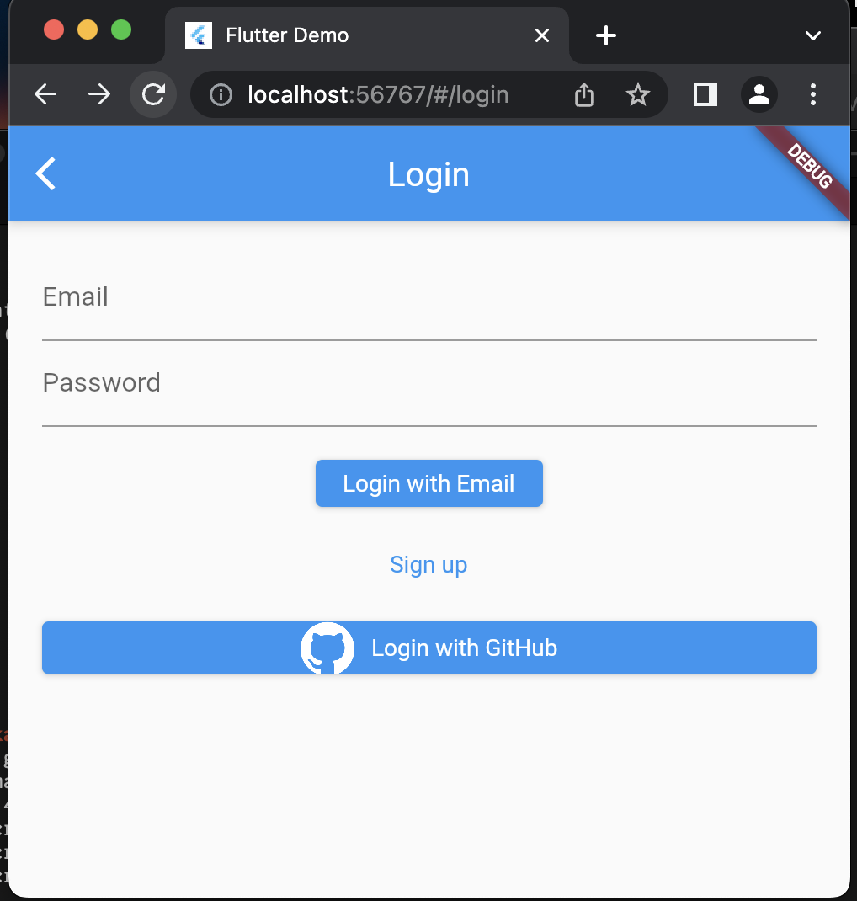
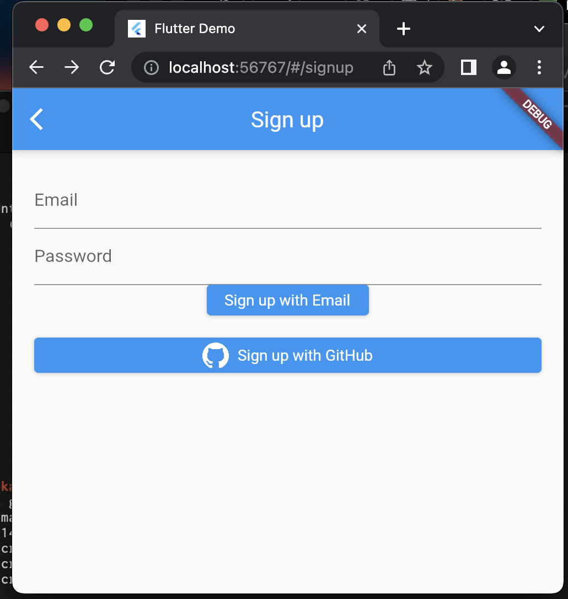

# oauth3_sample

WIP

## Getting Started

GPT-4 へのプロンプト

```text
あなたは flutter, pyhone プログラマだと仮定します。
flutter 3.6 で OAuth2 を使って,サインアップ、ログイン、ロウアウトするアプリを作ってください。
サーバーは flask で作ってください。必要なら sqlite を使ってください。

メールアドレストパスワード, github で認証できるようにしてください、
firebase は使わないでください。

機密情報は .env に保持してください。

ファイル構成案を示しますが、必要なら追加・変更して構いません。
  ```
    ├── lib/
    │   ├── main.dart
    │   ├── screens/
    │   │   ├── home.dart
    │   │   ├── login.dart
    │   │   └── signup.dart
    │   ├── services/
    │   │   ├── auth_service.dart
    │   │   └── api_service.dart
    │   └── utils/
    │       └── constants.dart
    ├── pubspec.yaml
    └── README.md
    │ 
	├── backend/
    │   ├── app.py
    │   ├── auth.py
    │   ├── database.py
    │   └── models.py
  ```
google, github, twitter の logo 画像は assets/images 以下に保持して、それを使う様にしてください。

最初にファイル構成を示してください。
ファイルのコードブロック毎に回答を分割して示してください。
"次を表示" と言ったら、次の回答を示してください。
ファイル内容は省略せずに表示してください。すべてのメソッドは必ず実装してください
```


```
cd backend
pip install -r requirements.txt

python app.py

```

## スクリーンショット

- ログイン


- サインアップ

